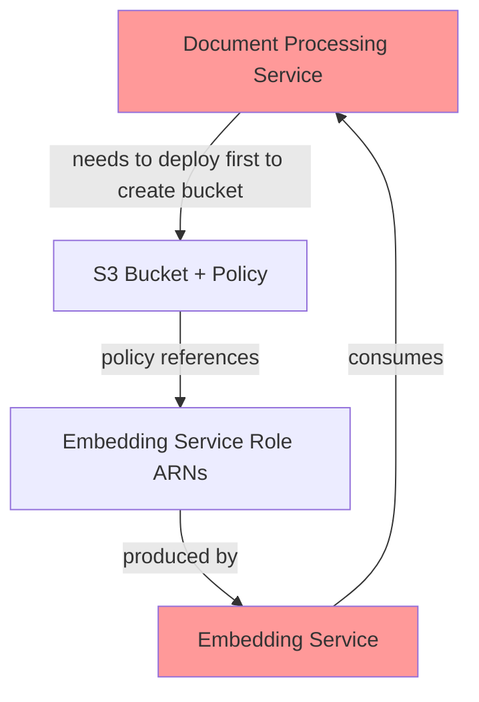
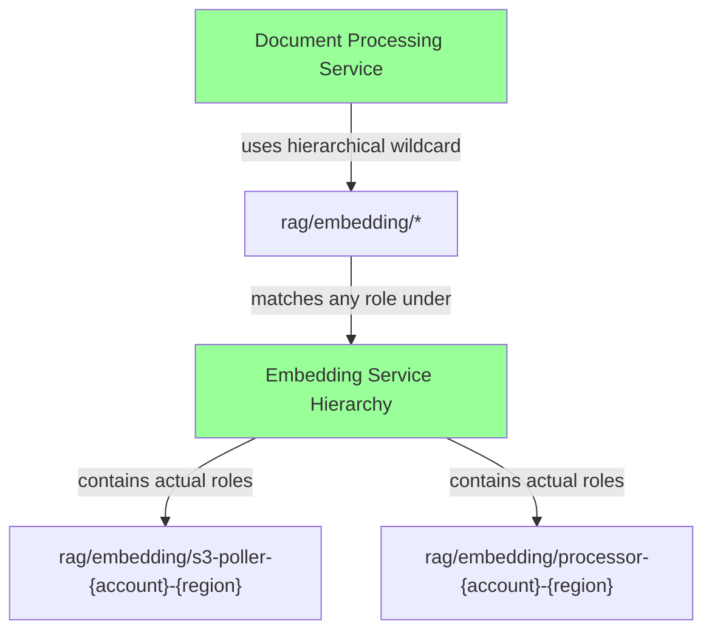

# OndemandEnv Hierarchical Naming Convention

## Overview

The OndemandEnv platform uses **hierarchical IAM role naming** combined with **wildcard conditions** to achieve clean cross-service access without circular dependencies. This approach eliminates the need for role ARN sharing between services while maintaining security and service isolation.

## Problem Solved

### Before: Circular Dependencies


### After: Hierarchical Naming + Wildcards


## Hierarchical Structure

### Service Hierarchy
```
rag/
├── embedding/
│   ├── s3-poller-{account}-{region}
│   ├── processor-{account}-{region}
│   └── dlq-handler-{account}-{region}
├── document-processing/
│   ├── s3-poller-{account}-{region}
│   ├── processor-{account}-{region}
│   ├── advanced-processor-{account}-{region}
│   └── dlq-handler-{account}-{region}
├── vector-storage/
│   ├── embeddings-poller-{account}-{region}
│   └── search-api-{account}-{region}
├── knowledge-retrieval/
│   └── api-{account}-{region}
└── generation/
    └── api-{account}-{region}
```

### Benefits

✅ **No Circular Dependencies** - Services can deploy in any order  
✅ **Clean Service Boundaries** - Each service owns its `/` hierarchy branch  
✅ **Wildcard Matching** - `rag/embedding/*` matches all embedding service roles  
✅ **Environment Isolation** - Account/region included in role names  
✅ **Scalable** - Easy to add new functions under existing hierarchies  
✅ **Secure** - Wildcards only within service boundaries  

## Implementation Patterns

### 1. Lambda Function Role Creation

```typescript
// Embedding Service - Hierarchical role naming
const s3PollerHandler = new NodejsFunction(this, 'EmbeddingS3PollerHandler', {
    functionName: `rag-embedding-s3-poller-${this.account}-${this.region}`,
    role: new iam.Role(this, 'EmbeddingS3PollerRole', {
        roleName: `rag/embedding/s3-poller-${this.account}-${this.region}`,     // ← Hierarchical
        assumedBy: new iam.ServicePrincipal('lambda.amazonaws.com'),
        managedPolicies: [
            iam.ManagedPolicy.fromAwsManagedPolicyName('service-role/AWSLambdaBasicExecutionRole')
        ]
    }),
    // ... rest of config
});
```

### 2. Cross-Service Access Policies

```typescript
// Document Processing Service - Wildcard access to embedding service
processedContentBucket.addToResourcePolicy(new iam.PolicyStatement({
    sid: 'AllowEmbeddingServiceAccess',
    effect: iam.Effect.ALLOW,
    principals: [new iam.AccountPrincipal(this.account)],
    actions: ['s3:GetObject', 's3:ListBucket'],
    resources: [
        processedContentBucket.bucketArn,
        `${processedContentBucket.bucketArn}/*`
    ],
    conditions: {
        'StringLike': {
            'aws:PrincipalArn': [`arn:aws:iam::${this.account}:role/rag/embedding/*`]  // ← Wildcard!
        }
    }
}));
```

### 3. Multiple Service Access

```typescript
// Vector Storage Service - Grant access to multiple downstream services
vectorMetadataBucket.addToResourcePolicy(new iam.PolicyStatement({
    sid: 'AllowDownstreamServices',
    effect: iam.Effect.ALLOW,
    principals: [new iam.AccountPrincipal(this.account)],
    actions: ['s3:GetObject', 's3:ListBucket'],
    resources: [vectorMetadataBucket.bucketArn, `${vectorMetadataBucket.bucketArn}/*`],
    conditions: {
        'StringLike': {
            'aws:PrincipalArn': [
                `arn:aws:iam::${this.account}:role/rag/knowledge-retrieval/*`,
                `arn:aws:iam::${this.account}:role/rag/generation/*`
            ]
        }
    }
}));
```

## Naming Rules

### Service Prefixes (Enforced by Contract Validation)

| Service | Allowed Prefixes |
|---------|------------------|
| `RagEmbeddingEnver` | `rag/embedding/` |
| `RagDocumentProcessingEnver` | `rag/document-processing/`, `rag/doc-processing/` |
| `RagDocumentIngestionEnver` | `rag/document-ingestion/`, `rag/doc-ingestion/` |
| `RagVectorStorageEnver` | `rag/vector-storage/` |
| `RagKnowledgeRetrievalEnver` | `rag/knowledge-retrieval/` |
| `RagGenerationEnver` | `rag/generation/` |

### Function Name Format

```
{service-prefix}/{component}-{account}-{region}
```

**Examples:**
- `rag/embedding/s3-poller-123456789012-us-east-1`
- `rag/document-processing/processor-123456789012-us-east-1`
- `rag/vector-storage/search-api-123456789012-us-east-1`

## Contract Validation

### Service-Level Validation

```typescript
// In RagEmbeddingEnver constructor
private validateEmbeddingServiceNaming(account: string, region: string): void {
    const expectedNames = [
        `rag/embedding/s3-poller-${account}-${region}`,
        `rag/embedding/processor-${account}-${region}`, 
        `rag/embedding/dlq-handler-${account}-${region}`
    ];

    // This serves as documentation and will be used by the CDK stack
    // to ensure proper naming convention is followed
    console.log(`Embedding service validated naming convention for: ${expectedNames.join(', ')}`);
}
```

### CDK Stack Implementation

```typescript
// In CDK stack - use validated naming
const functionNames = [
    `rag/embedding/s3-poller-${this.account}-${this.region}`,
    `rag/embedding/processor-${this.account}-${this.region}`,
    `rag/embedding/dlq-handler-${this.account}-${this.region}`
];

// Contract validation ensures these names are allowed for this service
myEnver.validateEmbeddingServiceNaming(this.account, this.region);
```

## Cross-Service Access Matrix

| Producer Service | Resource | Consumer Service | Wildcard Pattern |
|------------------|----------|------------------|------------------|
| Document Processing | `processedContentBucket` | Embedding | `rag/embedding/*` |
| Embedding | `embeddingsBucket` | Vector Storage | `rag/vector-storage/*` |
| Vector Storage | `vectorMetadataBucket` | Knowledge Retrieval | `rag/knowledge-retrieval/*` |
| Vector Storage | `vectorMetadataBucket` | Generation | `rag/generation/*` |
| Knowledge Retrieval | `knowledgeBaseBucket` | Generation | `rag/generation/*` |

## Migration Guide

### From Role ARN Sharing to Hierarchical Naming

1. **Update Contracts** - Remove role ARN producers/consumers
2. **Add Hierarchical Roles** - Create explicit IAM roles with hierarchy
3. **Update Resource Policies** - Use wildcard conditions instead of exact ARNs
4. **Add Validation** - Implement naming validation in contracts
5. **Test Cross-Service Access** - Verify wildcard permissions work

### Example Migration

**Before:**
```typescript
// Producer (Embedding Service)
new OdmdShareOut(this, new Map([
    [myEnver.s3PollerRoleArn, s3PollerHandler.role!.roleArn],  // ← Circular dependency
]));

// Consumer (Document Processing Service)
const embeddingRoleArn = myEnver.embeddingConsumer.getSharedValue(/* roleArn */);
processedContentBucket.addToResourcePolicy(/* exact ARN policy */);
```

**After:**
```typescript
// Producer (Embedding Service) - No role ARN sharing needed
const s3PollerHandler = new NodejsFunction(this, 'Handler', {
    role: new iam.Role(this, 'Role', {
        roleName: `rag/embedding/s3-poller-${this.account}-${this.region}`,  // ← Hierarchical
    }),
});

// Consumer (Document Processing Service) - Wildcard condition
processedContentBucket.addToResourcePolicy(new iam.PolicyStatement({
    conditions: {
        'StringLike': {
            'aws:PrincipalArn': [`arn:aws:iam::${this.account}:role/rag/embedding/*`]  // ← Wildcard
        }
    }
}));
```

## Security Considerations

### Principle of Least Privilege
- **Service Boundaries**: Wildcards only match within service hierarchies
- **Account Isolation**: Role names include account ID for environment separation
- **Regional Isolation**: Role names include region for geographic separation
- **Action Restrictions**: Resource policies still limit specific S3 actions

### Audit and Monitoring
- **CloudTrail**: All cross-service access logged with actual role names
- **IAM Access Analyzer**: Can detect overly permissive wildcard policies
- **Resource Policies**: Explicit resource ARNs prevent unintended access
- **Naming Validation**: Contract-level validation prevents naming conflicts

## Example: Complete Service Implementation

### Embedding Service (Producer)

```typescript
// 1. Define hierarchical roles
const s3PollerRole = new iam.Role(this, 'S3PollerRole', {
    roleName: `rag/embedding/s3-poller-${this.account}-${this.region}`,
    assumedBy: new iam.ServicePrincipal('lambda.amazonaws.com'),
});

const processorRole = new iam.Role(this, 'ProcessorRole', {
    roleName: `rag/embedding/processor-${this.account}-${this.region}`,
    assumedBy: new iam.ServicePrincipal('lambda.amazonaws.com'),
});

// 2. Create Lambda functions with hierarchical roles
const s3PollerHandler = new NodejsFunction(this, 'S3PollerHandler', {
    functionName: `rag-embedding-s3-poller-${this.account}-${this.region}`,
    role: s3PollerRole,
});

const processorHandler = new NodejsFunction(this, 'ProcessorHandler', {
    functionName: `rag-embedding-processor-${this.account}-${this.region}`,
    role: processorRole,
});

// 3. Share only bucket names (no role ARNs needed)
new OdmdShareOut(this, new Map([
    [myEnver.embeddingStorage.embeddingsBucket, embeddingsBucket.bucketName],
    // No role ARN sharing needed!
]));
```

### Document Processing Service (Consumer)

```typescript
// Grant access using hierarchical wildcard - no circular dependency!
processedContentBucket.addToResourcePolicy(new iam.PolicyStatement({
    sid: 'AllowEmbeddingServiceAccess',
    effect: iam.Effect.ALLOW,
    principals: [new iam.AccountPrincipal(this.account)],
    actions: ['s3:GetObject', 's3:ListBucket'],
    resources: [processedContentBucket.bucketArn, `${processedContentBucket.bucketArn}/*`],
    conditions: {
        'StringLike': {
            'aws:PrincipalArn': [`arn:aws:iam::${this.account}:role/rag/embedding/*`]
        }
    }
}));
```

## Best Practices

### ✅ Do's
- Use consistent hierarchical naming across all services
- Include account and region in role names for isolation
- Use `StringLike` with `aws:PrincipalArn` for wildcard matching
- Validate naming conventions in contract constructors
- Document cross-service access patterns
- Test wildcard permissions thoroughly

### ❌ Don'ts
- Don't use overly broad wildcards (`*` without service prefix)
- Don't mix hierarchical and flat naming in the same system
- Don't forget account/region isolation in role names
- Don't skip contract-level naming validation
- Don't use exact role ARN dependencies (creates circular deps)
- Don't use `StringEquals` with wildcards (use `StringLike`)

## Troubleshooting

### Common Issues

1. **Access Denied**: Check if role name matches wildcard pattern exactly
2. **Circular Dependencies**: Ensure no role ARN sharing in contracts
3. **Wrong Condition**: Use `StringLike` not `StringEquals` for wildcards
4. **Naming Conflicts**: Ensure service prefixes are unique and validated
5. **Environment Isolation**: Verify account/region in role names

### Debugging Tips

```bash
# Check actual role name
aws iam get-role --role-name "rag/embedding/s3-poller-123456789012-us-east-1"

# Check if wildcard pattern matches
aws iam list-roles --query "Roles[?starts_with(RoleName, 'rag/embedding/')]"

# Test S3 bucket policy
aws s3api get-bucket-policy --bucket my-processed-content-bucket
```

This hierarchical naming approach provides a robust, scalable foundation for cross-service access in the OndemandEnv platform while eliminating circular dependencies and maintaining security boundaries. 