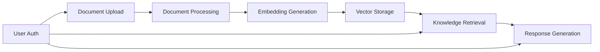

# RAG Contracts Library

This repository contains the OndemandEnv contracts for a serverless RAG (Retrieval-Augmented Generation) system built on AWS. It defines the microservices architecture and cross-service dependencies using the OndemandEnv platform patterns.

## 🏗️ Architecture Overview

The RAG system consists of 7 core components with **contracts-first architecture**:

1. **📤 Document Ingestion** - Document upload, validation, and status tracking
2. **⚙️ Document Processing** - Document parsing, chunking, and content extraction
3. **🔗 Embedding** - Vector embedding generation using AWS Bedrock
4. **💾 Vector Storage** - Vector database operations and management
5. **🔍 Knowledge Retrieval** - Vector search proxy and query processing
6. **🤖 Generation** - RAG response generation using LLMs
7. **🔐 User Authentication** - AWS Cognito-based authentication service

## 🔗 Service Coupling Patterns

### Contract-Based Communication
All services communicate through typed contracts using `OdmdCrossRefProducer` and `OdmdCrossRefConsumer`:

```typescript
// Example: Document Processing consumes from Document Ingestion
this.documentBucket = new OdmdCrossRefConsumer(
    this, 'doc-bucket',
    this.ingestionEnver.documentStorageResources
);
```

### Producer/Consumer Chain
Services form a processing pipeline where each service produces outputs for the next:

```
Document Ingestion → Document Processing → Embedding → Vector Storage
```

### Status Aggregation
Document Ingestion service aggregates status from all downstream services:

```typescript
// Wires status APIs from all downstream services
this.processingStatusApiEndpoint = new OdmdCrossRefConsumer(/*...*/);
this.embeddingStatusApiEndpoint = new OdmdCrossRefConsumer(/*...*/);
this.vectorStorageStatusApiEndpoint = new OdmdCrossRefConsumer(/*...*/);
```

## Project Structure

```
contractsLib-rag/
├── src/
│   ├── types.ts                      # Shared type definitions
│   ├── rag-contracts.ts              # Main contracts class
│   ├── contracts-build.ts            # Build contracts configuration
│   ├── index.ts                      # Exports
│   └── services/                     # Individual service definitions
│       ├── document-ingestion.ts     # Document ingestion service
│       ├── document-processing.ts    # Document processing service
│       ├── embedding.ts              # Embedding service
│       ├── vector-storage.ts         # Vector storage service
│       ├── knowledge-retrieval.ts    # Knowledge retrieval service
│       └── generation.ts             # Generation service
├── tests/                            # Test suites
├── package.json                      # Dependencies and scripts
├── tsconfig.json                     # TypeScript configuration
└── README.md                         # This file
```

## Services

### Document Ingestion Service
- **Repository**: `rag-document-ingestion-service`
- **Purpose**: Entry point for document uploads
- **Key Features**: 
  - S3 pre-signed URL generation
  - Document validation and quarantine
  - EventBridge event publishing
  - Web UI for document tracking

### Document Processing Service  
- **Repository**: `rag-document-processing-service`
- **Purpose**: Document parsing and preprocessing
- **Key Features**:
  - Multi-format document parsing (PDF, DOCX, TXT, etc.)
  - Text extraction and cleaning
  - Chunk generation with sentence boundary detection
  - S3 storage for processed content

### Embedding Service
- **Repository**: `rag-embedding-service` 
- **Purpose**: Generate vector embeddings using AWS Bedrock
- **Key Features**:
  - AWS Bedrock Titan Embed v2 integration
  - S3 polling for processed content
  - SQS-based batch processing
  - Embedding storage in S3

### Vector Storage Service
- **Repository**: `rag-vector-storage-service`
- **Purpose**: Vector database operations
- **Key Features**:
  - Vector database management (configurable backends)
  - Indexing and similarity search
  - Metadata management
  - Can integrate with home vector server for development

### Knowledge Retrieval Service
- **Repository**: `rag-knowledge-retrieval-service`
- **Purpose**: Retrieve relevant context for queries
- **Key Features**:
  - Semantic search
  - Query rewriting and expansion
  - Context ranking and filtering

### Generation Service
- **Repository**: `rag-generation-service`
- **Purpose**: Generate responses using LLMs
- **Key Features**:
  - LLM integration (OpenAI, Anthropic, Bedrock, etc.)
  - Prompt engineering and context injection
  - Response post-processing

## 🔄 Data Flow and Communication Patterns

### Main Processing Pipeline


### Cross-Service Communication Methods
1. **S3 Events** → SQS → Lambda processing (primary data flow)
2. **HTTP APIs** → Status checking and real-time queries
3. **EventBridge** → Async notifications and event routing
4. **Contract Resolution** → Deployment-time dependency wiring

### Data Storage and Schema Evolution
```
Document Ingestion → S3 Raw Documents + Metadata
       ↓ (S3 Events)
Document Processing → S3 Processed Content (JSON chunks) + Schema
       ↓ (S3 Events)
Embedding Service → S3 Embeddings (JSON vectors) + Schema
       ↓ (S3 Events)
Vector Storage → Vector Database + S3 Metadata
```

### Schema-Based Contracts
- **Versioned Schemas**: Git SHA-based schema evolution
- **Runtime Validation**: Zod-based input/output validation
- **S3 Artifact Storage**: Centralized schema distribution
- **Contract Compatibility**: Backward-compatible schema updates

## 🏠 Hybrid Architecture

### OndemandEnv Cloud Services
- **Production-ready** serverless microservices
- **AWS-managed** infrastructure with auto-scaling
- **Contract-based** service boundaries
- **Multi-account** deployment (dev/prod isolation)

### Home Vector Server (Development)
- **Local Docker container** for development
- **Weaviate-based** vector database
- **Proxy integration** via Knowledge Retrieval Service
- **Development-only** - not part of production pipeline

## 🔧 Deployment and Contract Management

### Manual Deployment Workflow
The system requires coordinated deployment due to contract dependencies:

1. **contractsLib-rag** changes → Manual build and publish to GitHub packages
2. **Service updates** → Update `package.json` to new contractsLib version
3. **Service deployment** → Each service rebuilds with updated contracts
4. **Contract resolution** → Automatic dependency wiring at deployment time

### Contract Resolution Process
```typescript
// In RagContracts constructor - wiring order matters
this.ragDocumentProcessingBuild.wireConsuming();
this.ragVectorStorageBuild.wireConsuming();
this.ragKnowledgeRetrievalBuild.wireConsuming();
// Document ingestion wired last - consumes from all others
this.ragDocumentIngestionBuild.wireConsuming();
```

## 🔐 Authentication and Security

### Centralized Authentication
- **AWS Cognito** User Pool integration
- **Google OAuth** primary authentication method
- **JWT tokens** for API access
- **Group-based authorization** ("odmd-rag-uploader" group)

### Security Patterns
- **Least privilege** IAM policies between services
- **VPC isolation** for network security
- **S3 encryption** for data at rest
- **Schema validation** at service boundaries
- **CORS configuration** for web UI security

## Environment Management

Each service has two environments:
- **Development** (`workspace0`): Mutable environment for testing
- **Production** (`workspace1`): Immutable environment for stable releases

## Event-Driven Architecture

The system uses EventBridge for loose coupling between services:
- **Document Ingestion** publishes `Document Validated` events
- **Document Processing** subscribes to validation events and publishes `Document Processed` events  
- **Embedding** polls S3 for processed content (no direct events)
- **Vector Storage** polls S3 for embeddings (no direct events)

## Home Vector Server vs Main Pipeline

**Important Distinction**:

### Main OndemandEnv Pipeline
- Production-ready serverless services
- AWS-managed infrastructure
- Automatic scaling and high availability
- S3-based service communication
- Contract-defined dependencies

### Home Vector Server
- Local development tool
- Docker-based standalone service
- For testing and development only
- NOT part of the ondemandenv.dev architecture
- Can be integrated via Vector Storage Service configuration

## 🚀 Getting Started

### Prerequisites
- Node.js 18+
- AWS CLI configured
- Access to ondemandenv.dev platform

### Installation

1. **Install dependencies**:
   ```bash
   npm install
   ```

2. **Build the project**:
   ```bash
   npm run build
   ```

3. **Run tests**:
   ```bash
   npm test
   ```

### Usage Examples

#### Basic Contract Instantiation
```typescript
import { App } from 'aws-cdk-lib';
import { RagContracts } from '@odmd-rag/contracts-lib-rag';

const app = new App();
const ragContracts = new RagContracts(app);

// Access service builds
const docIngestion = ragContracts.ragDocumentIngestionBuild;
const docProcessing = ragContracts.ragDocumentProcessingBuild;
const embedding = ragContracts.ragEmbeddingBuild;
const vectorStorage = ragContracts.ragVectorStorageBuild;
```

#### Cross-Service Contract Consumption
```typescript
// In a service that consumes from Document Ingestion
export class MyServiceEnver extends OdmdEnverCdk {
    documentBucket!: OdmdCrossRefConsumer<this, RagDocumentIngestionEnver>;
    
    wireConsuming() {
        const ingestionEnver = this.contracts.ragDocumentIngestionBuild.dev;
        this.documentBucket = new OdmdCrossRefConsumer(
            this, 'doc-bucket',
            ingestionEnver.documentStorageResources
        );
    }
}
```

#### Using Shared Values at Runtime
```typescript
// In Lambda handler or service logic
import { getSharedValue } from '@ondemandenv/contracts-lib-base';

const bucketName = await getSharedValue(this.myEnver.documentBucket);
// Result: "ragIngest-dev-doc-storage-bucket-abc123"
```

#### Schema-Based Validation
```typescript
// Services use generated Zod schemas for validation
import { documentMetadataSchema } from '../generated/schemas';

const validatedData = documentMetadataSchema.parse(inputData);
```

## Service Naming Convention

All services follow consistent naming patterns:

### CDK Construct Prefixes
- **Document Ingestion**: `Ing` (e.g., `IngValidationQueue`)
- **Document Processing**: `Proc` (e.g., `ProcBasicQueue`) 
- **Embedding**: `Emb` (e.g., `EmbProcessingQueue`)
- **Vector Storage**: `Vec` (e.g., `VecIndexQueue`)
- **Knowledge Retrieval**: `Ret` (e.g., `RetSearchQueue`)
- **Generation**: `Gen` (e.g., `GenResponseQueue`)

This ensures clear resource identification and avoids naming conflicts.

## Testing

The project includes comprehensive tests covering:
- Contract instantiation and singleton pattern
- Service build initialization
- GitHub repository configuration  
- AWS account setup
- Environment validation

Run tests with: `npm test`

## Contributing

1. Fork the repository
2. Create a feature branch
3. Make your changes following the OndemandEnv patterns
4. Add tests for new functionality
5. Submit a pull request

## License

This project is licensed under the MIT License. 