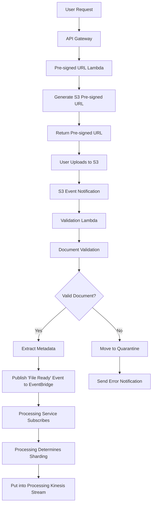

# Document Ingestion Service

## Overview

The Document Ingestion Service acts as the **entry point** for the RAG (Retrieval-Augmented Generation) system, handling document uploads, preprocessing, and triggering the downstream processing pipeline through event-driven architecture.

## Responsibilities

### 1. Document Upload Handling
- **Pre-signed URL Generation**: API Gateway endpoint generates S3 pre-signed URLs for secure direct uploads
- **Direct S3 Upload**: Users upload documents directly to S3 using pre-signed URLs (bypasses Lambda size limits)
- **S3 Event Triggers**: S3 upload completion triggers Lambda function via S3 event notifications
- **Document Validation**: Lambda validates document formats (PDF, DOC, TXT, etc.), file size, and content
- **Metadata Extraction**: Extracts metadata (file size, type, upload timestamp, user context)
- **Kinesis Publishing**: Validated documents are published to Kinesis stream for downstream processing

### 2. Event-Driven Processing
- **EventBridge Publishing**: Publishes "Document Validated" events to EventBridge topic
- **Decoupled Communication**: No direct knowledge of downstream processing services
- **Event Schema**: Standardized event format with document metadata and S3 location
- **Multiple Consumers**: Enables multiple services to subscribe (processing, analytics, audit)
- **Error Handling**: Invalid documents trigger separate error events

### 3. Service Boundaries
- **What Ingestion Owns**: Document validation, metadata extraction, EventBridge events
- **What Ingestion Doesn't Own**: Processing logic, sharding strategy, Kinesis streams
- **Clean Separation**: Processing service subscribes and handles its own business logic

## Technical Architecture

### Technology Stack
- **AWS Lambda**: 
  - Pre-signed URL generation function
  - Document validation and processing function
- **Amazon S3**: 
  - Document storage with event notifications
  - Quarantine bucket for invalid documents
- **Amazon API Gateway**: RESTful endpoint for pre-signed URL requests
- **Amazon Kinesis Data Streams**: Event streaming to downstream services
- **IAM Roles**: Security and access control with time-limited permissions

### Security Features
- IAM-based security with least-privilege access
- S3 bucket policies for document storage security
- API Gateway throttling and request validation
- End-to-end encryption in transit and at rest

### Serverless Design
- **No VPC**: Eliminates networking complexity and improves performance
- **Auto-scaling**: Handles variable document upload loads automatically
- **Pay-per-use**: Cost-effective serverless pricing model
- **Fast cold starts**: API Gateway loads in just a few hundred milliseconds

## Producer-Consumer Pattern

### Producer Implementation
The service implements the OndemandEnv producer pattern:

```typescript
export class DocumentProcessingStreamProducer extends OdmdCrossRefProducer<OdmdEnverCdk> {
    constructor(owner: OdmdEnverCdk, id: string) {
        super(owner, id, {
            children: [{pathPart: 'kinesis-stream'}]
        });
    }

    public get stream() {
        return this.children![0]!
    }
}
```

### Producer Integration
The service enver creates the producer:

```typescript
export class RagDocumentIngestionEnver extends OdmdEnverCdk {
    constructor(owner: RagDocumentIngestionBuild, targetAWSAccountID: string, targetAWSRegion: string, targetRevision: SRC_Rev_REF) {
        super(owner, targetAWSAccountID, targetAWSRegion, targetRevision);
        
        // Initialize Kinesis stream producer for document processing events
        this.documentProcessingStream = new DocumentProcessingStreamProducer(this, 'doc-processing-stream');
    }

    readonly documentProcessingStream: DocumentProcessingStreamProducer;
}
```

## Process Flow



## Event-Driven Architecture

### **Ingestion Service Responsibility:**
```typescript
// Publishes "document ready" events - doesn't care who consumes
await eventBridge.putEvents({
  Entries: [{
    Source: 'rag.document.ingestion',
    DetailType: 'Document Validated',
    Detail: JSON.stringify({
      documentId: 'doc-123',
      s3Bucket: 'documents-bucket',
      s3Key: 'validated/document.pdf',
      metadata: { size: 1024, type: 'pdf', userId: 'user-456' }
    })
  }]
});
```

### **Processing Service Responsibility:**
```typescript
// Subscribes to ingestion events and determines own sharding strategy
eventBridge.onEvent('rag.document.ingestion', 'Document Validated', async (event) => {
  const shardingKey = determineShardingKey(event.detail);
  
  await kinesis.putRecord({
    StreamName: 'document-processing-stream',
    PartitionKey: shardingKey, // Business logic determines this
    Data: JSON.stringify(event.detail)
  });
});

function determineShardingKey(document) {
  // Processing service's business logic
  if (document.metadata.type === 'pdf') return `pdf-${document.metadata.size}`;
  if (document.metadata.userId) return `user-${document.metadata.userId}`;
  return `default-${Date.now() % 10}`;
}
```

## Integration Points

### Upstream
- **Input**: Documents via API Gateway from users/applications
- **Authentication**: Amazon Cognito for user authentication
- **Validation**: Request validation and file format checking

### Downstream
- **Output**: Events to Document Processing Service via Kinesis Data Streams
- **Monitoring**: CloudWatch metrics and logs for observability
- **Error Handling**: Dead letter queues for failed processing

## Repository Structure

- **Repository**: `rag-document-ingestion-service`
- **Organization**: `odmd-rag`
- **Deployment**: Serverless framework or AWS SAM
- **Infrastructure**: AWS CDK for infrastructure as code

## Environment Configuration

### Development Environment
- **Account**: `workspace0` (975050243618)
- **Region**: `us-east-1`
- **Branch**: `dev`
- **Mutability**: Mutable for development iterations

### Production Environment
- **Account**: `workspace1` (590184130740)
- **Region**: `us-east-1`
- **Branch**: `main`
- **Mutability**: Immutable for stability

## Key Design Principles

### 1. Serverless-First
- No infrastructure management required
- Auto-scaling without VPC limitations
- Instant scaling and deployment

### 2. Event-Driven Architecture
- Asynchronous processing through AWS managed services
- No synchronous inter-service dependencies
- Loose coupling between microservices

### 3. Security by Design
- IAM-based access control
- Resource-based policies
- Fine-grained permissions

### 4. Cost Optimization
- Pay-per-use serverless pricing
- No idle infrastructure costs
- Efficient resource utilization

### 5. Operational Excellence
- Minimal operational overhead ("NoOps" approach)
- Comprehensive monitoring and logging
- Error handling and retry mechanisms

## Performance Characteristics

- **Cold Start**: ~200-300ms through API Gateway
- **Throughput**: Auto-scales based on demand
- **Latency**: Sub-second document processing initiation
- **Availability**: Multi-AZ deployment by default

## Monitoring and Observability

### CloudWatch Metrics
- Document upload counts and success rates
- Lambda function duration and error rates
- Kinesis stream throughput and lag

### Logging
- Structured logging for document processing events
- Error tracking and correlation IDs
- Audit trails for compliance

### Alerting
- Failed document processing notifications
- Performance threshold breaches
- Error rate monitoring

## Implementation Status

✅ **Architecture**: OndemandEnv producer-consumer pattern implemented  
✅ **Build**: TypeScript compilation successful  
✅ **Tests**: All validation tests passing  
✅ **Integration**: Kinesis stream producer configured  
✅ **Contracts**: Service contracts properly defined  
✅ **Repository**: GitHub repository configuration complete  

## Next Steps

1. **Service Implementation**: Develop the actual Lambda functions and infrastructure
2. **API Design**: Define OpenAPI specifications for document upload endpoints
3. **Testing**: Create integration tests for the complete workflow
4. **Deployment**: Set up CI/CD pipelines for automated deployment
5. **Monitoring**: Configure CloudWatch dashboards and alerts 